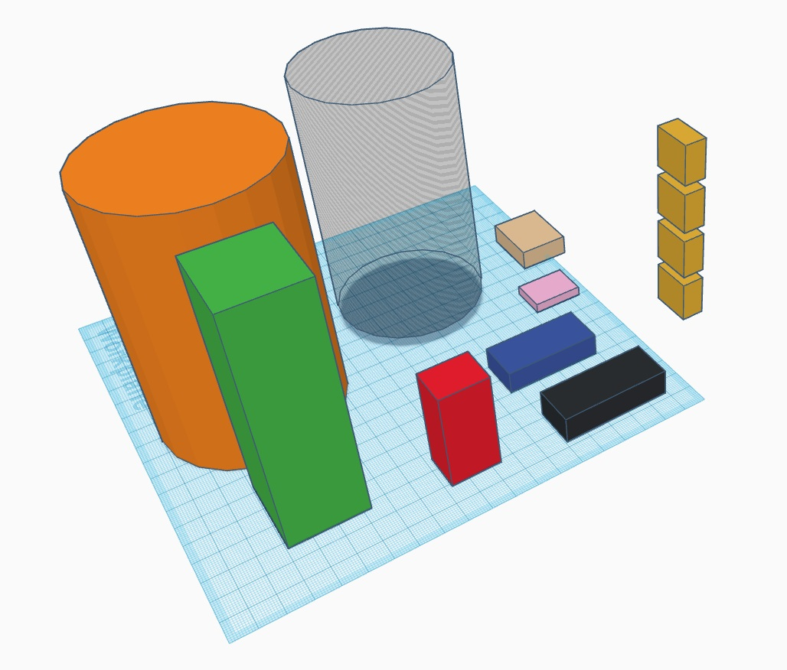

# IoTankard

Curious IoT test project.
Boardgames meet one handed beer drinking controller.


# Pin allocation

| Device        | Pins              | Notes                  |
| ------------- |:-------------:    | ----------------------:|
| MX Buttons    | D4,D5,D6,D7       |  Add 10k resistors     |
| HC-05 BT      | D2,D3             |   RX, TX               |
| OLED I2D      | A4,A5             |   SCL, SDA             |
| ADXL345       | D10,D11,D12,D13   |        SPI             |
| MotorDriver   | D9 (PWM)          |    Only one needed     |
| IF            | A2                |                        |

3 free digital and 5 analog pins

# TODO

- Should the motor drive 2 directions
- Should I add capasitor for motor
- Come up with the connection to laptop
- Try accelerometer SPI communication with 3 wires instead of 4
- Fix double tap provoking a single tap after
- Measure batterylife for one 18650 cell.
- Better visuals for screen

# Buttons

MX cherry copies. The key caps are yet to be decided on.
Use normal keycaps for first version.

# Motor

6V basic motor was used. Went for low durability solution and soldered a big chunk at the tip of axis. With big motor it seems a bit challenging to do short fast wibrations.

# Infrared

Things learned
- The sensor stops working if the adjustment screw is over 80 or under 20% of its rotation. Maybe cheap part.

# Casing

The Ebin game remote which this was originally supposed to be went through few brainstorming phases and finally came to a handle design. The handle can be used for future projects. For example for a single hand MMO and beer drinking controller.

1. "The Wand"

2. "The Remote"

3. "The Tankard

Trying to see if everything fits inside | Modeled all parts | Closest to final product before first print
--- | --- | ---
||
NOTE: next version will be done with fusion 360. At the moment of first desing I did not own any licenses to proper 3d design software.

# Bluetooth

Things learned
 - Do not spend hours of time debugging RX TX wires which are wrong way around.

The game engine this is made for can handle game controller inputs but for first version we went for bluetooth 
keyboard style and approach.

Converting the serial to key presses I used simple powershell script ( readCOM.ps1 )

```
    if ($port.IsOpen)
    {
        $data = $port.ReadLine()
        Add-Type -AssemblyName System.Windows.Forms
        [System.Windows.Forms.SendKeys]::SendWait($data);
```


| KEY        | TRIGGER              | Notes                  |
| ------------- |:-------------:    | ----------------------:|
| Q              | Button      |  Index finger    |
| W             | Button            |   middle finger              |
| E         | Button            |   ring ifnger             |
| R      | Button   |        pinkey finger             |
|  x  | IR sensor         |    x     |
|    x        | x                |           x             |


Trying to explain what I'm doing to team | Some of the prototyping hardware
--- | --- 
 |
